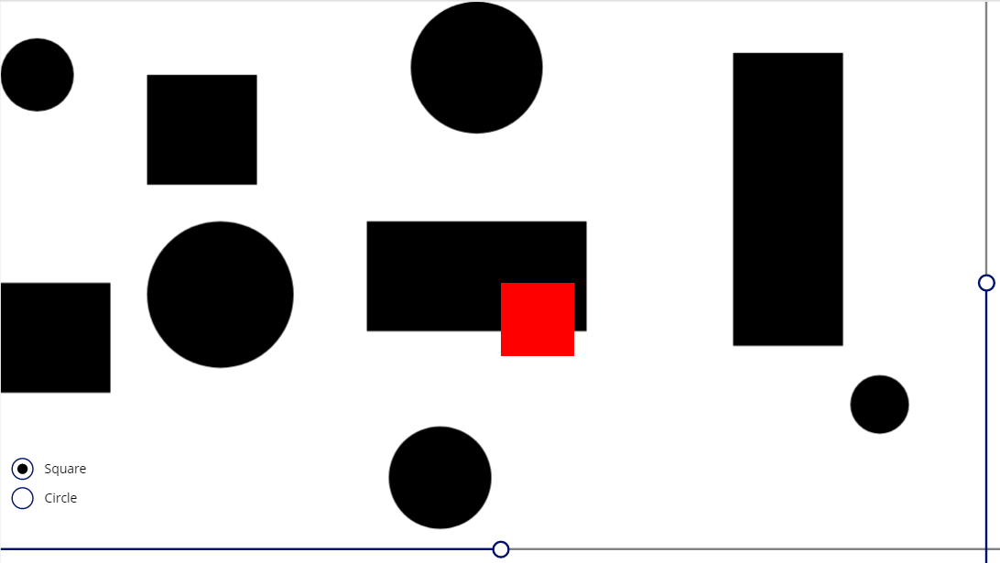

# Collision Detection Functions

## Summary

These functions detect whether two shapes (rectangular or circlular) overlap.



## Applies to

* Power Apps Canvas app

## Compatibility


## Prerequisites

None

## Solution

Solution|Author(s)
--------|---------
CollisionDetection-functions | [korune](https://github.com/korune) ([@koruneko32767](https://twitter.com/koruneko32767))

## Version history

Version|Date|Comments
-------|----|--------
1.0|May 30, 2021|Initial release


## Minimal Path to Awesome

* [Download](https://github.com/pnp/powerfx-samples/raw/main/samples/convertbasenumber-functions/solution/convertbasenumber-functions.msapp) the `.msapp` from the `solution` folder
* Use the `.msapp` file using **File** > **Open** > **Browse** within Power Apps Studio.

## Using the Source Code

  You can also use the [Power Apps Source Code tool](https://github.com/microsoft/PowerApps-Language-Tooling) to the code using these steps:
* Clone the repository to a local drive
* Pack the source files back into `.msapp` file:
  * [Power Apps Tooling Usage](https://github.com/microsoft/PowerApps-Language-Tooling)
* Use the `.msapp` file using **File** > **Open** > **Browse** in Power Apps Studio.

## Features

This sample includes following features:

* SquareSquare(Square and Square collision detection.)
* CircleCircle(Circle and Circle collision detection.)
* SquareCircle(Square and Circle collision detection.)

## Functions

### SquareSquare

This function is used to square and square collision detection.  

#### Syntax

```
SquareSquare(x_1, y_1, width_1, height_1, x_2, y_2, width_2, height_2)
```

Parameter | Description | Required | Type
---|---|---|--
`x_1` | X of Obj1 | Yes | Number
`y_1` | Y of Obj1 | Yes | Number
`width_1` | Width of Obj1 | Yes | Number
`height_1` | Height of Obj1 | Yes | Number
`x_2` | X of Obj2 | Yes | Number
`y_2` | Y of Obj2 | Yes | Number
`width_2` | Width of Obj2 | Yes | Number
`height_2` | Height of Obj2 | Yes | Number


#### Output

Boolean

#### Example

```excel
SquareSquare(
    Rectangle1.X, Rectangle1.Y, Rectangle1.Width, Rectangle1.Height,
    Rectangle2.X, Rectangle2.Y, Rectangle2.Width, Rectangle2.Height
)
```

### CircleCircle

This function is used to circle and circle collision detection.  

#### Syntax

```
CircleCircle(x_1, y_1, width_1, height_1, x_2, y_2, r_2)
```

Parameter | Description | Required | Type
---|---|---|--
`x_1` | X of Obj1 | Yes | Number
`y_1` | Y of Obj1 | Yes | Number
`r_1` | Redius of Obj1 | Yes | Number
`x_2` | X of Obj2 | Yes | Number
`y_2` | Y of Obj2 | Yes | Number
`r_2` | Redius of Obj2 | Yes | Number


#### Output

Boolean

#### Example

```excel
CircleCircle(
    Circle1.X, Circle1.Y, Circle1.Width / 2,
    Circle2.X, Circle2.Y, Circle2.Width / 2
)
```

### SquareCircle

This function is used to sequence and circle collision detection.  

#### Syntax

```
SquareCircle(x_1, y_1, width_1, height_1, x_2, y_2, r_2)
```

Parameter | Description | Required | Type
---|---|---|--
`x_1` | X of Obj1 | Yes | Number
`y_1` | Y of Obj1 | Yes | Number
`width_1` | Width of Obj1 | Yes | Number
`height_1` | Height of Obj1 | Yes | Number
`x_2` | X of Obj2 | Yes | Number
`y_2` | Y of Obj2 | Yes | Number
`r_2` | Redius of Obj2 | Yes | Number


#### Output

Boolean

#### Example

```excel
SquareCircle(
    Rectangle1.X, Rectangle1.Y, Rectangle1.Width, Rectangle1.Height,
    Circle2.X, Circle2.Y, Circle2.Width / 2
)
```

## Disclaimer

**THIS CODE IS PROVIDED *AS IS* WITHOUT WARRANTY OF ANY KIND, EITHER EXPRESS OR IMPLIED, INCLUDING ANY IMPLIED WARRANTIES OF FITNESS FOR A PARTICULAR PURPOSE, MERCHANTABILITY, OR NON-INFRINGEMENT.**


