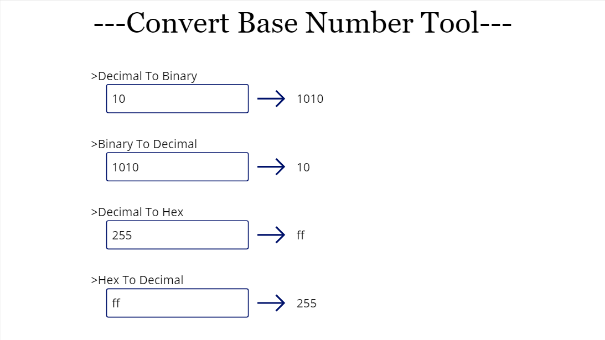
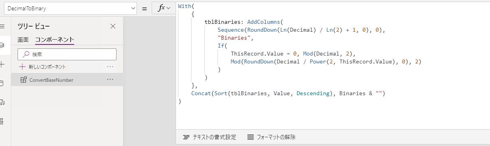
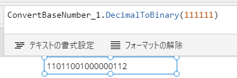
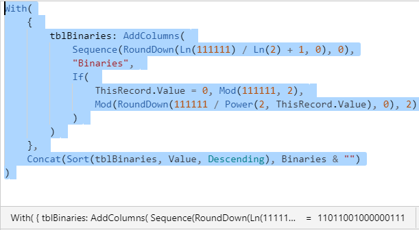

# Convert Base Number Functions

## Summary

This function is convert base numbers.



## Applies to

* Power Apps Canvas app

## Compatibility


## Prerequisites

None

## Solution

Solution|Author(s)
--------|---------
convertbasenumber-functions | [korune](https://github.com/korune) ([@koruneko32767](https://twitter.com/koruneko32767))

## Version history

Version|Date|Comments
-------|----|--------
1.0|March 14, 2021|Initial release

## Disclaimer

**THIS CODE IS PROVIDED *AS IS* WITHOUT WARRANTY OF ANY KIND, EITHER EXPRESS OR IMPLIED, INCLUDING ANY IMPLIED WARRANTIES OF FITNESS FOR A PARTICULAR PURPOSE, MERCHANTABILITY, OR NON-INFRINGEMENT.**

---

## Minimal Path to Awesome

* [Download](https://github.com/pnp/powerfx-samples/raw/main/samples/convertbasenumber-functions/solution/convertbasenumber-functions.msapp) the `.msapp` from the `solution` folder
* Use the `.msapp` file using **File** > **Open** > **Browse** within Power Apps Studio.

## Using the Source Code

  You can also use the [Power Apps Source Code tool](https://github.com/microsoft/PowerApps-Language-Tooling) to the code using these steps:
* Clone the repository to a local drive
* Pack the source files back into `.msapp` file:
  * [Power Apps Tooling Usage](https://github.com/microsoft/PowerApps-Language-Tooling)
* Use the `.msapp` file using **File** > **Open** > **Browse** in Power Apps Studio.

## Features

This sample includes following features:

* Convert Hex to Decimal
* Convert Decimal to Hex
* Convert Binary to Decimal
* Convert Decimal to Binary

## Functions

### HexToDecimal

This function is used to convert hex to decimal.  

This function was created based on the one created by Hiro.  
https://github.com/mofumofu-dance/PowerApps365/raw/master/Samples/Custom%20functions%20sample.msapp

#### Syntax

```
HexToDecimal(Hex)
```

Parameter | Description | Required | Type
---|---|---|--
Hex | Hex that you want to convert to decimal | Yes | Text


#### Output

Number

#### Example

```excel
HexToDecimal("5A")
```

### DecimalToHex

This function is used to convert decimal to hex.  

Note that values greater than `16^12 - 1` will not be converted correctly due to the precision of the calculations in Power Apps.

#### Syntax

```
DecimalToHex(Decimal)
```

Parameter | Description | Required | Type
---|---|---|--
Decimal | Decimal that you want to convert to hex | Yes | Number


#### Output

Text

#### Example

```excel
DecimalToHex(123)
```

### BinaryToDecimal

This function is used to convert binary to decimal.  

#### Syntax

```
BinaryToDecimal(Binary)
```

Parameter | Description | Required | Type
---|---|---|--
Binary | Binary that you want to convert to decimal | Yes | Number


#### Output

Number

#### Example

```excel
BinaryToDecimal(1101)
```

### DecimalToBinary

This function is used to convert decimal to binary.  

**CAUTION**  
I'm currently experiencing a bug where the conversion of certain decimal numbers to binary does not work properly.  

* When called from a function:  



* If the expression is defined directly in the canvas app:  


I have determined that this is an issue on the custom function side of Power Apps, and not a bug in the custom function I created, so I am not actively fixing it at this time.  

This issue is also discussed [here](https://powerusers.microsoft.com/t5/Building-Power-Apps/Bug-For-the-calculation-results-of-Enhanced-Component/m-p/866288#M275333).  

#### Syntax

```
DecimalToBinary(Decimal)
```

Parameter | Description | Required | Type
---|---|---|--
Dicimal | Decimal that you want to convert to binary | Yes | Number


#### Output

Number

#### Example

```excel
DecimalToBinary(345)
```


