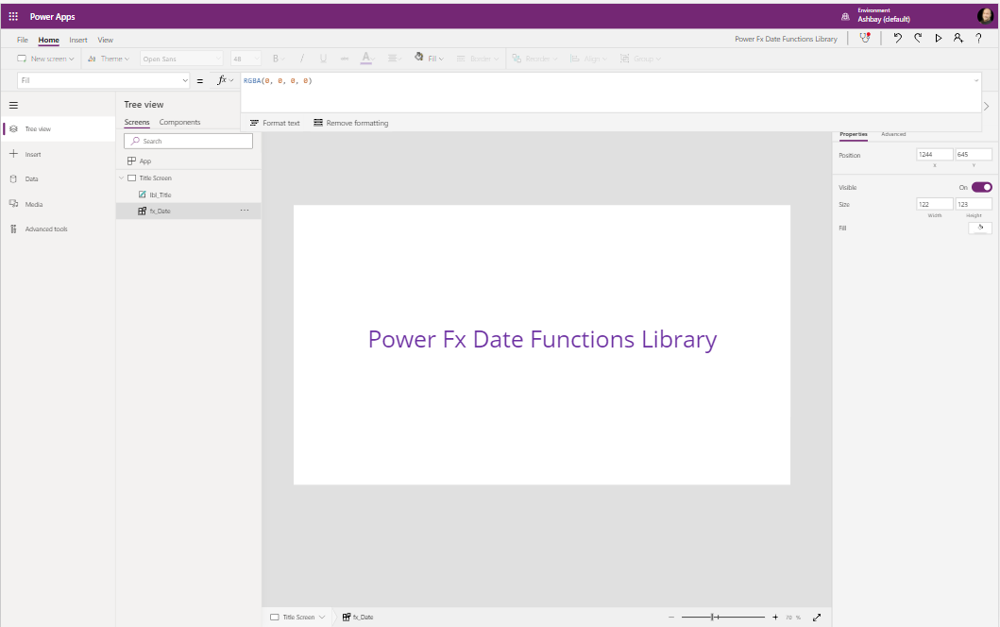

# Date Functions

## Summary

Functions that perform operations on a date value



* [EndOfQuarter](#EndOfQuarter)
* [EndOfMonth](#EndOfMonth)
* [EndOfWeek](#EndOfWeek)
* [EndOfYear](#EndOfYear)
* [IsBetweenDates](#IsBetweenDates)
* [IsLeapYear](#IsLeapYear)
* [IsInCurrentDay](#IsInCurrentDay)
* [IsInCurrentMonth](#IsInCurrentMonth)
* [IsInCurrentQuarter](#IsInCurrentQuarter)
* [IsInCurrentWeek](#IsInCurrentWeek)
* [IsInCurrentYear](#IsInCurrentYear)
* [IsInNextNDays](#IsInNextNDays)
* [IsInNextNMonths](#IsInNextNMonths)
* [IsInNextNQuarters](#IsInNextNQuarters)
* [IsInNextNWeeks](#IsInNextNWeeks)
* [IsInNextNYears](#IsInNextNYears)
* [IsInPreviousNDays](#IsInPreviousNDays)
* [IsInPreviousNMonths](#IsInPreviousNMonths)
* [IsInPreviousNQuarters](#IsInPreviousNQuarters)
* [IsInPreviousNWeeks](#IsInPreviousNWeeks)
* [IsInPreviousNYears](#IsInPreviousNYears)
* [NetWorkDays](#NetWorkDays)
* [StartOfQuarter](#StartOfQuarter)
* [StartOfMonth](#StartOfMonth)
* [StartOfWeek](#StartOfWeek)
* [StartOfYear](#StartOfYear)
* [WeekOfMonth](#WeekOfMonth)
* [WeekOfYear](#WeekOfYear)
* [YearFraction](#YearFraction)

## Applies to

* [Microsoft Power Fx](https://docs.microsoft.com/en-us/power-platform/power-fx/overview)


## Compatibility


## Prerequisites

None

## Solution

Solution|Author(s)
--------|---------
date-functions | [Matthew Devaney](https://github.com/matthewdevaney) ([@mattbdevaney](https://twitter.com/mattbdevaney))

## Version history

Version|Date|Comments
-------|----|--------
1.0|February 8, 2021|Initial release

## Disclaimer

**THIS CODE IS PROVIDED *AS IS* WITHOUT WARRANTY OF ANY KIND, EITHER EXPRESS OR IMPLIED, INCLUDING ANY IMPLIED WARRANTIES OF FITNESS FOR A PARTICULAR PURPOSE, MERCHANTABILITY, OR NON-INFRINGEMENT.**

---

## Minimal Path to Awesome

* [Download](solution/powerfx-date-functions.msapp) the `.msapp` from the `solution` folder
* Use the `.msapp` file using **File** > **Open** > **Browse** within Power Apps Studio.


## Using the Source Code

  You can also use the [Power Apps Source Code tool](https://github.com/microsoft/PowerApps-Language-Tooling) to the code using these steps:
* Clone the repository to a local drive
* Pack the source files back into `.msapp` file:
  * [Power Apps Tooling Usage](https://github.com/microsoft/PowerApps-Language-Tooling)
* Use the `.msapp` file using **File** > **Open** > **Browse** in Power Apps Studio.

## Functions

### EndOfQuarter

Get the last day of a quarter.

#### Syntax

```excel
StartOfQuarter(StartDate [, AddQuarters])
```


Parameter | Description | Required | Type
---|---|---|---
`StartDate` | The date value to which the number of quarters will be added|Yes | DateTime
`AddQuarters` | The number of quarters you wish to add to the `StartDate` | No |Number

#### Output

Date


### EndOfMonth

Get the last day of a month.

#### Syntax

```excel
EndOfMonth(StartDate [, AddMonths])
```

Parameter | Description | Required | Type
---|---|---|---
`StartDate`| The date value from which the end of the month will be extracted| Yes | DateTime
`AddMonths` | The number of months to add to the `StartDate` | No |Number


#### Output

Date


### EndOfWeek

Get the last day of a week.

#### Syntax

```excel
EndOfWeek(StartDate [, AddWeeks, DayWeekStart])
```

Parameter | Description | Required | Type
---|---|---|---
`StartDate`| The date from which the end of the week will be extracted | Yes | DateTime
`AddWeeks` | The number of weeks to add to `StartDate` | No |Number
`DayWeekStart` | A number value for day of the week to use as the start of the week | No |Number


#### Output

Date


### EndOfYear

Get the last day of a year.

#### Syntax

```excel
EndOfYear(StartDate [, AddYears])
```

Parameter | Description | Required | Type
---|---|---|---
`StartDate`| The date value from which the end of the year date will be extracted| Yes | DateTime
`AddYears`| The number value to indicate how many years to add to the `StartDate` | No |Number


#### Output

Date

### IsBetweenDates

Checks if a date is within a specified date range 

#### Syntax

```excel
IsBetweenDates(EvaluateDate, StartDate, EndDate)
```

Parameter | Description | Required | Type
---|---|---|---
`EvaluateDate`|The date value to evaluate | Yes | DateTime
`StartDate`|The date value indicating the start of the date range to test | Yes | DateTime
`EndDate`|The date value indicating the end of the date range to test| Yes | DateTime


#### Output
Boolean


### IsLeapYear

Checks if a date belongs to a leap year.

#### Syntax

```excel
IsLeapYear(EvaluateDate)

```

Parameter | Description | Required | Type
---|---|---|---
`EvaluateDate`| The date value to evaluate  | Yes | DateTime


#### Output

Boolean


### IsInCurrentDay

Checks if a date occurs within the current day

#### Syntax

```excel
IsInCurrentDay(EvaluateDate)
```

Parameter | Description | Required | Type
---|---|---|---
`EvaluateDate`| The date value to evaluate | Yes | DateTime


#### Output

Boolean


### IsInCurrentMonth

Checks if a date occurs within the current month

#### Syntax

```excel
IsInCurrentMonth(EvaluateDate)
```

Parameter | Description | Required | Type
---|---|---|---
`EvaluateDate`|The date value you wish to evalute | Yes | DateTime


#### Output

Boolean


### IsInCurrentQuarter

Checks if a date occurs within the current quarter

#### Syntax

```excel
IsInCurrentQuarter(EvaluateDate)
```

Parameter | Description | Required | Type
---|---|---|---
`EvaluateDate`|The date value to evaluate | Yes | DateTime


#### Output

Boolean


## IsInCurrentWeek

Checks if a date occurs within the current week

#### Syntax

```excel
IsInCurrentWeek(EvaluateDate, DayWeekStart)
```

Parameter | Description | Required | Type
---|---|---|---
`EvaluateDate`|The date value to evaluate | Yes | DateTime
`DayWeekStart`|The numeric value indicating which day of the week is considered the first day or the week| Yes | Number


#### Output

Boolean


### IsInCurrentYear

Checks if a date occurs within the current year

#### Syntax

```excel
IsInCurrentYear(EvaluateDate)
```

Parameter | Description | Required | Type
---|---|---|---
`EvaluateDate`|The date value to evaluate | Yes | DateTime


#### Output

Boolean


### IsInNextNDays

Checks if a date occurs within the next number of days. Start date defaults to the current date.

#### Syntax

```excel
IsInNextNDays(EvaluateDate, NumberOfDays [, StartDate])
```

Parameter | Description | Required | Type
---|---|---|---
`EvaluateDate`|The date value to evaluate | Yes | DateTime
`NumberOfDays`|The number value indicating how many days from the `StartDate`. If `StartDate` is not specified, it will calculate from today's date | Yes | Number
`StartDate`|The date value to compare with `EvaluateDate`. If not specified, today's date will be used.| No |DateTime


#### Output

Boolean


### IsInNextNMonths

Checks if a date occurs within the next number of months. Start date defaults to the current date.

#### Syntax

```excel
IsInNextNMonths(EvaluateDate, NumberOfMonths [, StartDate])
```

Parameter | Description | Required | Type
---|---|---|---
`EvaluateDate`|The date value to evaluate | Yes | DateTime
`NumberOfMonths`|The number value to indicate the number of months from `StartDate`. If `StartDate` is not specified, it will calculate from today's date| Yes | Number
`StartDate`|The date value to compare with `EvaluateDate`. If not specified, today's date will be used.| No |DateTime


#### Output

Boolean


### IsInNextNQuarters

Checks if a date occurs within the next number of quarters. Start date defaults to the current date.

#### Syntax

```excel
IsInNextNQuarters(EvaluateDate, NumberOfQuarters [, StartDate])
```

Parameter | Description | Required | Type
---|---|---|---
`EvaluateDate`|The date value to evaluate | Yes | DateTime
`NumberOfQuarters`|The number value to indicate the number of quarters to add to `StartDate`. If `StartDate` is not specified, it will calculate from today's date. | Yes | Number
`StartDate`|The date value to compare with `EvaluateDate`. If not specified, today's date will be used| No |DateTime


#### Output

Boolean


### IsInNextNWeeks

Checks if a date occurs within the next number of weeks. Start date defaults to the current date.

#### Syntax

```excel
IsInNextNWeeks(EvaluateDate, NumberOfWeeks [, StartDate])
```

Parameter | Description | Required | Type
---|---|---|---
`EvaluateDate`|The date value to evaluate | Yes | DateTime
`NumberOfWeeks`|The number value to indicate the number of weeks to add to `StartDate`. If `StartDate` is not specified, it will calculate from today's date. | Yes | Number
`StartDate`|The date value to compare with `EvaluateDate`. If not specified, today's date will be used| No |DateTime


#### Output

Boolean


### IsInNextNYears

Checks if a date occurs within the next number of years. Start date defaults to the current date.

#### Syntax

```excel
IsInNextNYears(EvaluateDate, NumberOfYears [, StartDate])
```

Parameter | Description | Required | Type
---|---|---|---
`EvaluateDate`|The date value to evaluate| Yes | DateTime
`NumberOfYears`|The number value to indicate the number of years to add to `StartDate`. If `StartDate` is not specified, it will calculate from today's date. | Yes | Number
`StartDate`|The date value to compare with `EvaluateDate`. If not specified, today's date will be used| No |DateTime


#### Output

Boolean


### IsInPreviousNDays

Checks if a date occurs within the previous number of days. Start date defaults to the current date.

#### Syntax

```excel
IsInPreviousNDays(EvaluateDate, NumberOfDays [, StartDate])
```

Parameter | Description | Required | Type
---|---|---|---
`EvaluateDate`|The date value to evaluate| Yes | DateTime
`NumberOfDays`|The number value to indicate the number of days to subtract from `StartDate`. If `StartDate` is not specified, it will calculate from today's date. | Yes | Number
`StartDate`|The date value to compare with `EvaluateDate`. If not specified, today's date will be used| No |DateTime


#### Output

Boolean


### IsInPreviousNMonths

Checks if a date occurs within the previous number of months. Start date defaults to the current date.

#### Syntax

```excel
IsInPreviousNMonths(EvaluateDate, NumberOfMonths [, StartDate])
```

Parameter | Description | Required | Type
---|---|---|---
`EvaluateDate`|The date value to evaluate| Yes | DateTime
`NumberOfMonths`|The number value to indicate the number of months to subtract from `StartDate`. If `StartDate` is not specified, it will calculate from today's date. | Yes | Number
`StartDate`|The date value to compare with `EvaluateDate`. If not specified, today's date will be used| No |DateTime


#### Output

Boolean


### IsInPreviousNQuarters

Checks if a date occurs within the previous number of quarters. Start date defaults to the current date.

#### Syntax

```excel
IsInPreviousNQuarters(EvaluateDate, NumberOfQuarters [, StartDate])
```

Parameter | Description | Required | Type
---|---|---|---
`EvaluateDate`|The date value to evaluate| Yes | DateTime
`NumberOfQuarters`|The number value to indicate the number of quarters to subtract from `StartDate`. If `StartDate` is not specified, it will calculate from today's date. | Yes | Number
`StartDate`|The date value to compare with `EvaluateDate`. If not specified, today's date will be used| No |DateTime


#### Output

Boolean


### IsInPreviousNWeeks

Checks if a date occurs within the previous number of weeks. Start date defaults to the current date.

#### Syntax

```excel
IsInPreviousNWeeks(EvaluateDate, NumberOfWeeks [, StartDate])
```

Parameter | Description | Required | Type
---|---|---|---
`EvaluateDate`|The date value to evaluate| Yes | DateTime
`NumberOfWeeks`|The number value to indicate the number of weeks to subtract from `StartDate`. If `StartDate` is not specified, it will calculate from today's date. | Yes | Number
`StartDate`|The date value to compare with `EvaluateDate`. If not specified, today's date will be used| No |DateTime


#### Output

Boolean


### IsInPreviousNYears

Checks if a date occurs within the previous number of years. Start date defaults to the current date.

#### Syntax

```excel
IsInPreviousNYears(EvaluateDate, NumberOfYears [, StartDate])
```

Parameter | Description | Required | Type
---|---|---|---
`EvaluateDate`|The date value to evaluate| Yes | DateTime
`NumberOfYears`|The number value to indicate the number of years to subtract from `StartDate`. If `StartDate` is not specified, it will calculate from today's date. | Yes | Number
`StartDate`|The date value to compare with `EvaluateDate`. If not specified, today's date will be used| No |DateTime


#### Output

Boolean

### NetWorkDays

Find the number of work days between two dates.

#### Syntax

```excel
NetWorkDays(StartDate, EndDate)
```

Parameter | Description | Required | Type
---|---|---|---
`StartDate`|The date value for the start of the date range| Yes | DateTime
`EndDate`|The date value for the end of the date range| Yes | DateTime


#### Output

Number


### StartOfMonth

Get the first day of a month.

#### Syntax

```excel
StartOfMonth(StartDate [, AddMonths])
```

Parameter | Description | Required | Type
---|---|---|---
`StartDate`|The date value to evaluate| Yes | DateTime
`AddMonths`|The number value to indicate the number of months to add to `StartDate`.| No | Number


#### Output

Date


### StartOfQuarter

Get the first day of a quarter.

#### Syntax

```excel
StartOfQuarter(StartDate [, AddQuarters])
```

Parameter | Description | Required | Type
---|---|---|---
`StartDate`|The date value to evaluate| Yes | DateTime
`AddQuarters`|The number value to indicate the number of quarters to add to `StartDate`.| No | Number


#### Output

Date


### StartOfWeek

Get the first day of a week.

#### Syntax

```excel
StartOfWeek(StartDate [, AddWeeks, DayWeekStart])
```

Parameter | Description | Required | Type
---|---|---|---
`StartDate`|The date value to evaluate| Yes | DateTime
`AddWeeks`|The number value to indicate the number of weeks to add to `StartDate`. | No | Number
`DayWeekStart`|The numeric value indicating which day of the week is considered the first day or the week| No | Number


#### Output

Date


### StartOfYear

Get the first day of a year.

#### Syntax

```excel
StartOfYear(StartDate [, AddYears])
```

Parameter | Description | Required | Type
---|---|---|---
`StartDate`|The date value to evaluate| Yes | DateTime
`AddYears`| The number value to indicate how many years to add to the `StartDate` | No |Number


#### Output

Date


### WeekOfMonth

Takes a date and returns a week number (1-6) that corresponds to the week of the month.

#### Syntax

```excel
WeekOfMonth(StartDate [,DayWeekStart])
```

Parameter | Description | Required | Type
---|---|---|---
`StartDate`|The date value to evaluate| Yes | DateTime
`DayWeekStart`|The numeric value indicating which day of the week is considered the first day or the week| Yes | Number

#### Output

Number


### WeekOfYear

Takes a date and returns a week number (1-54) that corresponds to the week of the year.

#### Syntax

```excel
WeekNumber(StartDate [,DayWeekStart])
```

Parameter | Description | Required | Type
---|---|---|---
`StartDate`|The date value to evaluate| Yes | DateTime
`DayWeekStart`|The numeric value indicating which day of the week is considered the first day or the week| Yes | Number

#### Output

Number

### YearFraction

Calculates a decimal number representing the fraction of a year between two dates.

#### Syntax

```excel
YearFraction(StartDate, EndDate [,Basis])
```

Parameter | Description | Required | Type
---|---|---|---
`StartDate`|The date value for the start of the date range| Yes | DateTime
`EndDate`|The date value for the end of the date range| Yes | DateTime
`Basis`|The number value to indicate the basis| No |Number

#### Output

Number


