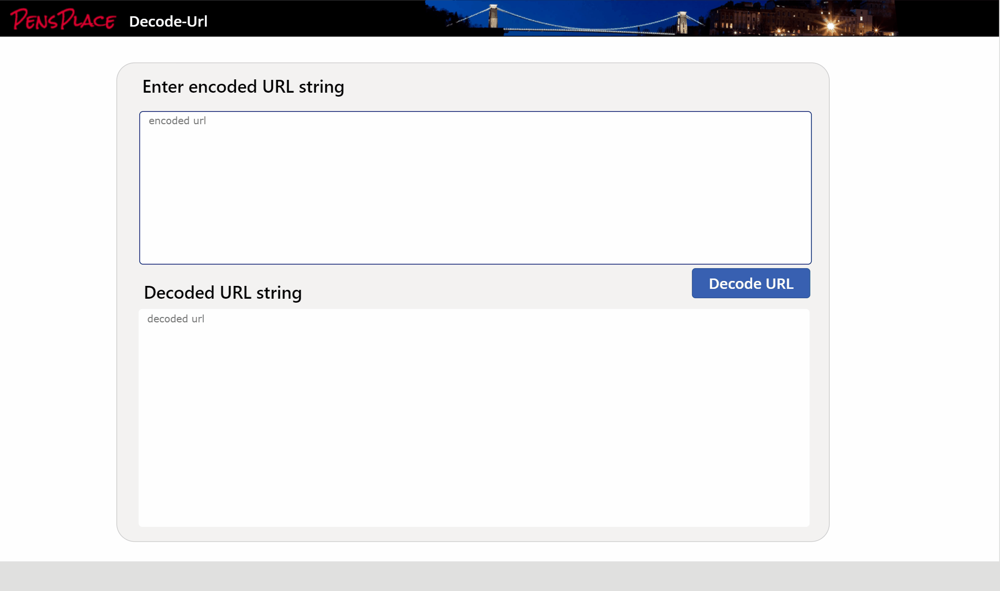

# Decode-Url

Function to decode a URL encoded string and return the decoded value.

## Summary



## Applies to

* [Microsoft Power Fx](https://docs.microsoft.com/en-us/power-platform/power-fx/overview)

## Compatibility


## Solution

Solution|Author(s)
--------|---------
decode-url | [Pen Warner](https://github.com/P3N-101) ([@p3nf0ld](https://twitter.com/p3nf0ld))

## Version history

Version|Date|Comments
-------|----|--------
1.0|June 3, 2021|Initial release

## Disclaimer

**THIS CODE IS PROVIDED *AS IS* WITHOUT WARRANTY OF ANY KIND, EITHER EXPRESS OR IMPLIED, INCLUDING ANY IMPLIED WARRANTIES OF FITNESS FOR A PARTICULAR PURPOSE, MERCHANTABILITY, OR NON-INFRINGEMENT.**

---

## Minimal Path to Awesome

* [Download](solution\decode-url.msapp) the `.msapp` from the `solution` folder
* Use the `.msapp` file using **File** > **Open** > **Browse** within Power Apps Studio.

## Using the Source Code

  You can also use the [Power Apps Source Code tool](https://github.com/microsoft/PowerApps-Language-Tooling) to the code using these steps:
* Clone the repository to a local drive
* Pack the source files back into `.msapp` file:
  * [Power Apps Tooling Usage](https://github.com/microsoft/PowerApps-Language-Tooling)
* Use the `.msapp` file using **File** > **Open** > **Browse** in Power Apps Studio.

## Functions

### Decode-Url

> Decodes a url encoded string and returns the result.

#### Syntax

```excel
Decode-Url(url)
```

Parameter | Description | Required | Type
---|---|---|--
url |The URL encoded string to decode| Yes | Text

#### Output

> Returns a decoded Text string 


