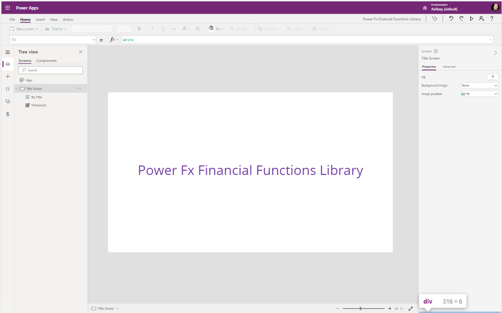

# Financial Functions
functions that are used by accounting & finance



* [FV](#FV)
* [PV](#PV)
* [NPER](#NPER)
* [PMT](#PMT)

## Applies to

* [Microsoft Power Fx](https://docs.microsoft.com/en-us/power-platform/power-fx/overview)


## Compatibility


## Prerequisites

None

## Solution

Solution|Author(s)
--------|---------
date-functions | [Matthew Devaney](https://github.com/matthewdevaney) ([@mattbdevaney](https://twitter.com/mattbdevaney))

## Version history

Version|Date|Comments
-------|----|--------
1.0|February 8, 2021|Initial release

## Disclaimer

**THIS CODE IS PROVIDED *AS IS* WITHOUT WARRANTY OF ANY KIND, EITHER EXPRESS OR IMPLIED, INCLUDING ANY IMPLIED WARRANTIES OF FITNESS FOR A PARTICULAR PURPOSE, MERCHANTABILITY, OR NON-INFRINGEMENT.**

---

## Minimal Path to Awesome

* [Download](https://github.com/pnp/powerfx-samples/raw/main/samples/financial-functions/solution/powerfx-financial-functions.msapp) the `.msapp` from the `solution` folder
* Use the `.msapp` file using **File** > **Open** > **Browse** within Power Apps Studio.


## Using the Source Code

  You can also use the [Power Apps Source Code tool](https://github.com/microsoft/PowerApps-Language-Tooling) to the code using these steps:
* Clone the repository to a local drive
* Pack the source files back into `.msapp` file:
  * [Power Apps Tooling Usage](https://github.com/microsoft/PowerApps-Language-Tooling)
* Use the `.msapp` file using **File** > **Open** > **Browse** in Power Apps Studio.

## Functions

### FV

Future value: a cash balance you want to attain after the last payment is made.

#### Syntax

```excel
FV(Rate, NPER, PMT [, PV])
```

Parameter | Description | Required | Type
---|---|---|---
`Rate`|The interest rate per period| Yes | Number
`NPER`|The total number of payment periods in an annuity| Yes | Number
`PMT`|The payment made each period; it cannot change over the life of the annuity| Yes | Number
`PV`|The present value, or the lump-sum amount that a series of future payments is worth right now. If omitted, it is assumed to be 0| No | Number

#### Output

Number


#### Example


```excel
FV(0.06, 10,-200, -500)
```

```excel
FV(0.12, 12,-1000)
```


### PV

Present value: the total amount that a series of future payments is worth now

#### Syntax

```excel
PV(Rate, NPER, PMT [, FV])
```

Parameter | Description | Required | Type
---|---|---|---
`Rate`|The interest rate per period | Yes | Number
`NPER`|The total number of payment periods in an annuity| Yes | Number
`PMT`|The payment made each period and cannot change over the life of the annuity| Yes | Number
`FV`|The future value, or a cash balance you want to attain after the last payment is made. If omitted, it is assumed to be 0 | No | Number

#### Output

Number


#### Example


```excel
PV(50000, 0.08,20)
```


### NPER

The total number of payments for a loan

#### Syntax

```excel
NPER(Rate, PMT, PV [, FV])
```

Parameter | Description | Required | Type
---|---|---|---
`Rate`|The interest rate per period| Yes | Number
`PMT`| The payment made each period; it cannot change over the life of the annuity. Typically, pmt contains principal and interest but no other fees or taxes| Yes | Number
`PV`|The present value, or the lump-sum amount that a series of future payments is worth right now| Yes | Number
`FV`|The future value, or a cash balance you want to attain after the last payment is made. If omitted, it is assumed to be 0 | No | Number

#### Output

Number


#### Example


```excel
NPER(0.12, -100,-1000, 10000)
```

### PMT

The payment made each period over the life of an investment.

### Syntax

```excel
PV(Rate, NPER, PV [, FV])
```

Parameter | Description | Required | Type
---|---|---|---
`Rate`|The interest rate for the loan| Yes | Number
`NPER`|The interest rate for the loan| Yes | Number
`PV`|he present value, or the total amount that a series of future payments is worth now; also known as the principal| Yes | Number
`FV`|The future value, or a cash balance you want to attain after the last payment is made. If omitted, it is assumed to be 0| No | Number

#### Output

Number

#### Example


```excel
PV(0.08, 10, 10000)
```

```excel
PV(0.06, 18, 50000)
```


