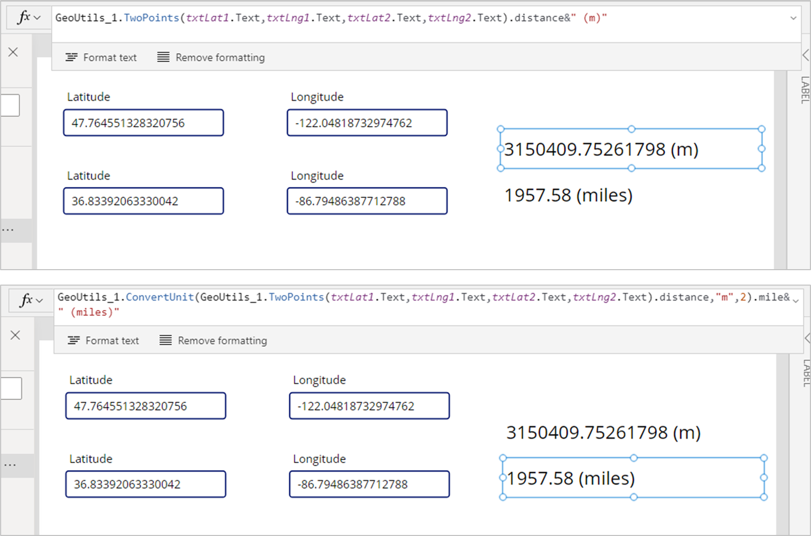

# Geolocation Utilities

## Summary

This function calculate distance and compass heading between two locations.



## Applies to

* Power Apps Canvas app

## Compatibility


## Prerequisites

None

## Solution

Solution|Author(s)
--------|---------
geolocation-utils | [Hiroaki Nagao](https://github.com/mofumofu-dance) ([@mofumofu_dance](https://twitter.com/mofumofu_dance))

## Version history

Version|Date|Comments
-------|----|--------
1.0|March 7, 2021|Initial release

## Disclaimer

**THIS CODE IS PROVIDED *AS IS* WITHOUT WARRANTY OF ANY KIND, EITHER EXPRESS OR IMPLIED, INCLUDING ANY IMPLIED WARRANTIES OF FITNESS FOR A PARTICULAR PURPOSE, MERCHANTABILITY, OR NON-INFRINGEMENT.**

---

## Minimal Path to Awesome

* [Download](https://github.com/pnp/powerfx-samples/raw/main/samples/geolocation-utils/solution/GeoLocation-Utils.msapp) the `.msapp` from the `solution` folder
* Use the `.msapp` file using **File** > **Open** > **Browse** within Power Apps Studio.


## Using the Source Code

  You can also use the [Power Apps Source Code tool](https://github.com/microsoft/PowerApps-Language-Tooling) to the code using these steps:
* Clone the repository to a local drive
* Pack the source files back into `.msapp` file:
  * [Power Apps Tooling Usage](https://github.com/microsoft/PowerApps-Language-Tooling)
* Use the `.msapp` file using **File** > **Open** > **Browse** in Power Apps Studio.

## Features

This sample includes following features:

* Calculate distance of given two locations (pair of latitude and longitude).
* Convert unit of distance from one to another (ex. meter to mile)

## Functions

### TwoPoints

Calculate distance in unit of meter and compass heading.

(Heading is the angle measured clockwise with north at 0 degrees, i.e., North: 0, East: 90, South:180, West: 270)

#### Syntax

```excel
TwoPoints(Lat1, Lng1, Lat2, Lng2)
```


Parameter | Description|Required | Type
---|---|---|---
`Lat1` |The number value representing the latitude of the first point to evaluate| Yes | Number
`Lng1` |The number value representing the longitude of the first point to evaluate| Yes | Number
`Lat2` |The number value representing the latitude of the second point to evaluate| Yes | Number
`Lng2` |The number value representing the longitude of the second point to evaluate| Yes | Number

#### Output

* Record

#### Example


```excel
{ distance: 13245.12445, heading: 99.234 }
```

### ConvertUnit

Perform unit conversion for length.

#### Syntax

```excel
ConvertUnit(Length, Unit, DecimalPoint)
```


Parameter | Description|Required | Type
---|---|---|---
`Length` | The number value representing the length| Yes | Number
`Unit` |The text value representing the unit. Acceptable values are `m`, `cm`, `km`, `inch`, `feet`, `yard`, `mile`| Yes | Text
`DecimalPoint` |The number value representing the decimal point precision| No | Number

#### Output

* Record

#### Example


```excel
{cm: 315040975.26, feet: 10335990, inch: 124031880.02, km: 3150.41, m: 3150409.75, mile: 1957.58, yard: 3445330}
```

