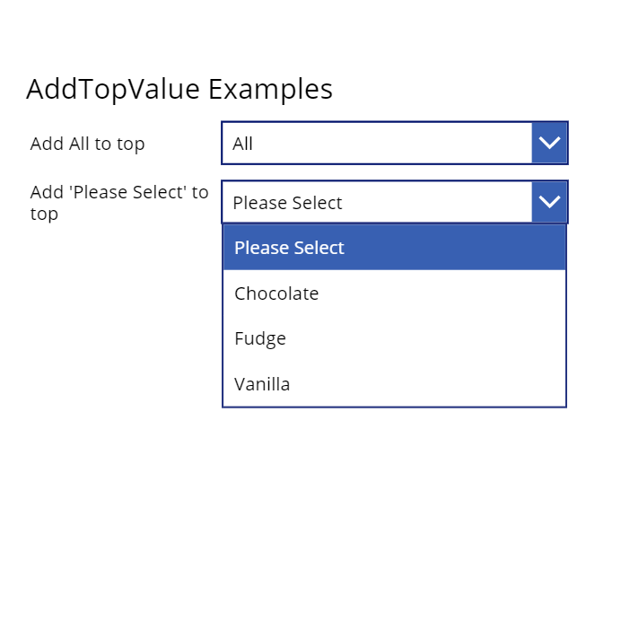

# Regex User Defined Functions Library

## Summary

Functions that perform operations on a list

* [ListFunctions](https://github.com/pnp/powerfx-samples/tree/main/samples/list-functions)

The following image shows the custom function (component) properties and a sample implementation of List Functions when added to Power App:



## Applies to

* Power Apps Canvas app

## Compatibility


## Prerequisites

None


## Solution

Solution|Author(s)
--------|---------
ListFunctions  | [Laura GB](https://github.com/Laura-GB)

## Version history

Version|Date|Comments
-------|----|--------
1.0|Mar 6, 2021|Initial Release


## Disclaimer

*THIS CODE IS PROVIDED *AS IS* WITHOUT WARRANTY OF ANY KIND, EITHER EXPRESS OR IMPLIED, INCLUDING ANY IMPLIED WARRANTIES OF FITNESS FOR A PARTICULAR PURPOSE, MERCHANTABILITY, OR NON_INFRINGEMENT.*

---
## Minimal Path to Awesome

* [Download](https://github.com/pnp/powerfx-samples/blob/main/samples/list-functions/solution) the `.msapp` from the `solution` folder
* Use the `.msapp` file using **File** > **Open** > **Browse** within Power Apps Studio.

> Include any additional steps as needed.
> DELETE THIS PARAGRAPH BEFORE SUBMITTING

## Using the Source Code

  You can also use the [Power Apps Source Code tool](https://github.com/microsoft/PowerApps-Language-Tooling) to the code using these steps:

* Clone the repository to a local drive
* Pack the source files back into `.msapp` file:
  * [Power Apps Tooling Usage](https://github.com/microsoft/PowerApps-Language-Tooling)
* Use the `.msapp` file using **File** > **Open** > **Browse** in Power Apps Studio.

## Functions 

Functions that perform operations on a list

* [AddTopValue](#AddTopValue)

## AddTopValue
Adds a value to a list of values ready to use in a drop down box. Returns a single column, named Result, table.

#### Syntax

```excel
AddTopValue(DataList [, TopValue])
```

Parameter | Description|Required | Type
---|---|---|---
`DataList` |single column, named Result|Required|table
`TopValue` |string with default value of All|Optional|text
</br></br>


