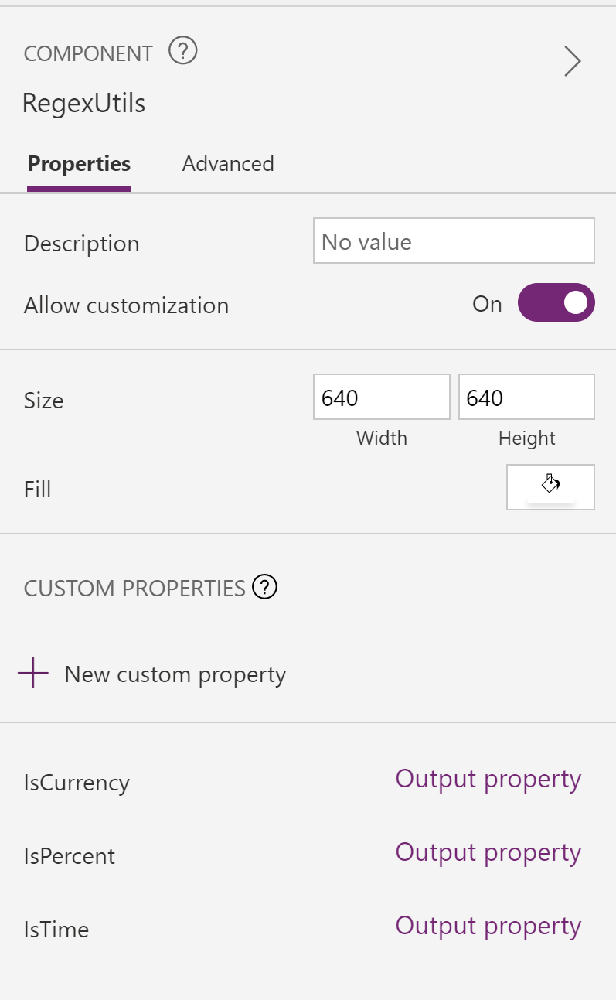
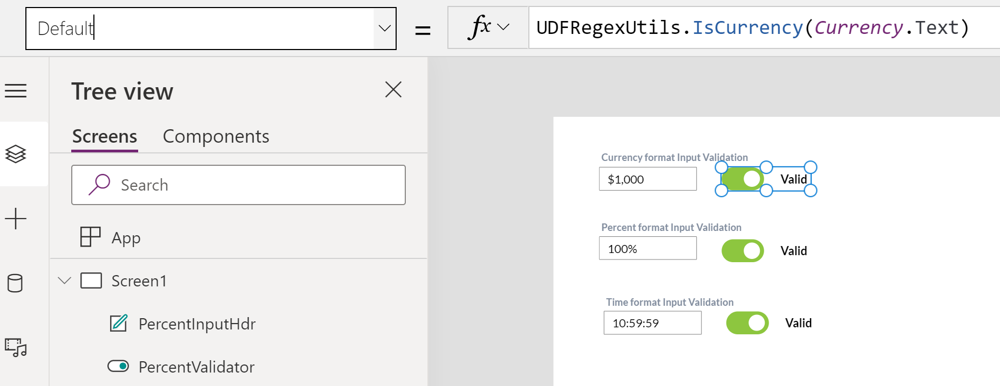

# Regex User Defined Functions Library

## Summary

Functions that performs regex match on currency, percent & time formats

* [RegexUtils](https://github.com/pnp/powerfx-samples/tree/main/samples/regex-functions#Regex-Utils)

The following image shows the custom function (component) properties and a sample implementation of RegexUtils when added to Power App:





## Applies to

* Power Apps Canvas app

## Compatibility


## Prerequisites

None


## Solution

Solution|Author(s)
--------|---------
RegexUtils  | [Geetha Sivasaiam](https://github.com/GSiVed)
RegexUtils  | [P3N](https://github.com/P3N-101)

## Version history

Version|Date|Comments
-------|----|--------
1.0|Mar 1, 2021|Initial Release


## Disclaimer

*THIS CODE IS PROVIDED *AS IS* WITHOUT WARRANTY OF ANY KIND, EITHER EXPRESS OR IMPLIED, INCLUDING ANY IMPLIED WARRANTIES OF FITNESS FOR A PARTICULAR PURPOSE, MERCHANTABILITY, OR NON_INFRINGEMENT.*

---
## Minimal Path to Awesome

* [Download](https://github.com/pnp/powerfx-samples/raw/main/samples/regex-functions/solution/RegexFunctions.msapp) the `.msapp` from the `solution` folder
* Use the `.msapp` file using **File** > **Open** > **Browse** within Power Apps Studio.

> Include any additional steps as needed.
> DELETE THIS PARAGRAPH BEFORE SUBMITTING

## Using the Source Code

  You can also use the [Power Apps Source Code tool](https://github.com/microsoft/PowerApps-Language-Tooling) to the code using these steps:

* Clone the repository to a local drive
* Pack the source files back into `.msapp` file:
  * [Power Apps Tooling Usage](https://github.com/microsoft/PowerApps-Language-Tooling)
* Use the `.msapp` file using **File** > **Open** > **Browse** in Power Apps Studio.

## Functions 

Functions that perform operations on a date value

* [IsCanadaPhoneNumber](#IsCanadaPhoneNumber)
* [IsCreditCard](#IsCreditCard)
* [IsCurrency](#IsCurrency)
* [IsEmail](#IsEmail)
* [IsIPAddress](#IsIPAddress)
* [IsNHSNumber](#IsNHSNumber)
* [IsPercent](#IsPercent)
* [IsTime](#IsTime)
* [IsUKDrivingLicence](#IsUKDrivingLicence)
* [IsUKNationalInsuranceNumber](#IsUKNationalInsuranceNumber)
* [IsUKPassport](#IsUKPassport)
* [IsUKPhoneNumber](#IsUKPhoneNumber)
* [IsURL](#IsURL)
* [IsUSPhoneNumber](#IsUSPhoneNumber)
* [IsUSSocialSecurityNumber](#IsUSSocialSecurityNumber)

### IsCanadaPhoneNumber

Indicates whether a string follows a valid Canadian phone number pattern

#### Syntax

```excel
IsCanadaPhoneNumber(CanadianPhoneNumberTxt)
```


Parameter | Description|Required | Type
---|---|---|---
`CanadianPhoneNumberTxt` | The text value to evaluate for a Canadian phone number|Yes | Text

#### Output

* Boolean


### IsCreditCard

Indicates whether a string follows a valid credit card pattern, such Visa, Mastercard, AMEX

#### Syntax

```excel
IsCreditCard(CreditCardTxt)
```


Parameter | Description|Required | Type
---|---|---|---
`CreditCardTxt` | The text value to evaluate for a credit card pattern|Yes | Text


### IsCurrency

Regex to validate currency format (US)

#### Syntax

```excel
IsCurrency(CurrencyTxt)
```


Parameter | Description|Required | Type
---|---|---|---
`CurrencyTxt` | The text value to evaluate for a currency format|Yes | Text

#### Output

* Boolean

### IsEmail

Indicates whether a string follows a valid email address pattern

#### Syntax

```excel
IsEmail(EmailTxt)
```


Parameter | Description|Required | Type
---|---|---|---
`EmailTxt` | The text value to evaluate for a email pattern|Yes | Text

#### Output

* Boolean


### IsIPAddress

Indicates whether a string follows a valid IPV4 address pattern

#### Syntax

```excel
IsIPAddress(IPv4Txt)
```


Parameter | Description|Required | Type
---|---|---|---
`IPv4Txt` | The text value to evaluate for an IPV4 address pattern|Yes | Text

#### Output

* Boolean


### IsNHSNumber

Indicates whether a string follows a valid UK NHS number pattern

#### Syntax

```excel
IsNHSNumber(NHSNumberTxt)
```


Parameter | Description|Required | Type
---|---|---|---
`NHSNumberTxt` | The text value to evaluate for a valid UK NHS number pattern|Yes | Text

#### Output

* Boolean


### IsPercent
Regex to validate percent format

#### Syntax

```excel
IsPercent(PercentTxt)
```

Parameter | Description|Required | Type
---|---|---|---
`PercentTxt` |The text value to evaluate for a percent format|Yes | Text


#### Output

* Boolean

### IsTime

Regex to validate time format [hh:mm:ss]/[hr:min:sec]/[mm:ss]/[m:s]/[ss]/[s]

#### Syntax

```excel
IsTime(TimeTxt)
```

Parameter | Description|Required | Type
---|---|---|---
`TimeTxt` |The text value to evaluate for a time format|Yes | Text

#### Output

* Boolean

### IsPercent
Regex to validate percent format

#### Syntax

```excel
IsPercent(PercentTxt)
```

Parameter | Description|Required | Type
---|---|---|---
`PercentTxt` |The text value to evaluate for a percent format|Yes | Text


#### Output

* Boolean

### IsUKDrivingLicence

Regex to validate whether a string matches a valid UK driving license pattern

#### Syntax

```excel
IsUKDrivingLicence(UKDrivingLicenceTxt)
```

Parameter | Description|Required | Type
---|---|---|---
`UKDrivingLicenceTxt` |The text value to evaluate for a valid UK driving license pattern|Yes | Text

#### Output

* Boolean

### IsUKNationalInsuranceNumber
Regex to validate whether a string matches a valid UK National Insurance Number pattern

#### Syntax

```excel
IsUKNationalInsuranceNumber(UKNINumberTxt)
```

Parameter | Description|Required | Type
---|---|---|---
`UKNINumberTxt` |The text value to evaluate for a valid UK National Insurance Number pattern|Yes | Text


#### Output

* Boolean

### IsUKPassport

Regex to validate whether a string matches a valid UK passport pattern

#### Syntax

```excel
IsUKPassport(UKPassportTxt)
```

Parameter | Description|Required | Type
---|---|---|---
`UKPassportTxt` |The text value to evaluate for a valid UK passport pattern|Yes | Text

#### Output

* Boolean


### IsUKPhoneNumber

Regex to validate whether a string matches a valid UK phone number pattern

#### Syntax

```excel
IsUKPhoneNumber(UKPhoneNumberTxt)
```

Parameter | Description|Required | Type
---|---|---|---
`UKPhoneNumberTxt` |The text value to evaluate for a valid UK phone number pattern|Yes | Text

#### Output

* Boolean


### IsURL

Regex to validate whether a string matches a valid URL pattern

#### Syntax

```excel
IsURL(URLTxt)
```

Parameter | Description|Required | Type
---|---|---|---
`URLTxt` |The text value to evaluate for a valid URL pattern|Yes | Text

#### Output

* Boolean

### IsUSPhoneNumber

Regex to validate whether a string matches a valid US phone number pattern

#### Syntax

```excel
IsUSPhoneNumber(USPhoneNumberTxt)
```

Parameter | Description|Required | Type
---|---|---|---
`USPhoneNumberTxt` |The text value to evaluate for a valid US phone number pattern|Yes | Text

#### Output

* Boolean

### IsUSSocialSecurityNumber

Regex to validate whether a string matches a valid US Social Security number pattern

#### Syntax

```excel
IsUSSocialSecurityNumber(USSNTxt)
```

Parameter | Description|Required | Type
---|---|---|---
`USSNTxt` |The text value to evaluate for a valid US US Social Security number pattern|Yes | Text

#### Output

* Boolean


