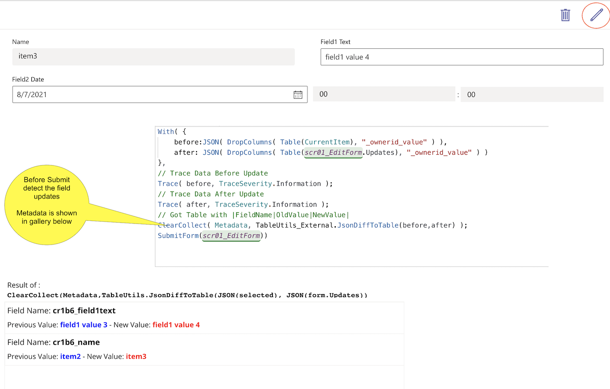

# Table Utility Functions

## Summary

This is a `TableUtils` PowerApp Component containing Custom Functions that allow to transform a Record in a Table



## Applies to

* Power Apps [Canvas App](https://docs.microsoft.com/en-us/powerapps/maker/canvas-apps/)

## Compatibility


## Solution

Solution|Author(s)
--------|---------
table-functions | [bsorrentino](https://github.com/settings/profile) ([@bsorrentinoJ](https://twitter.com/bsorrentinoJ))

## Version history

Version|Date|Comments
-------|----|--------
1.0.0.2|August 7, 2021|Initial release


## Prerequisites

None

## Minimal Path to Awesome

* [Download](solution\table-functions.msapp) the `.msapp` from the `solution` folder
* Use the `.msapp` file using **File** > **Open** > **Browse** within Power Apps Studio.

## Using the Source Code

  You can also use the [Power Apps Source Code tool](https://github.com/microsoft/PowerApps-Language-Tooling) to the code using these steps:
* Clone the repository to a local drive
* Pack the source files back into `.msapp` file:
  * [Power Apps Tooling Usage](https://github.com/microsoft/PowerApps-Language-Tooling)
* Use the `.msapp` file using **File** > **Open** > **Browse** in Power Apps Studio.

## Features

This sample includes following features:

* `JsonToTable` - Transform a JSON Object in an equivalent PowerFx Table
 > This function could be very useful for debug purpose 
* `JsonDiffToTable` - Compare two JSON and return only the fields that are changed as PowerFx Table
 > This function could be very useful for detect fields that have changed before submitting a form

## Functions

### JsonToTable

Transform a JSON Object representing a single record in an equivalent PowerFx Table

#### Syntax

```
JsonToTable(json)
```

Parameter | Description | Required | Type
---|---|---|--
json | JSON Object representing a single record | Yes | Text


#### Output

Table - `[ { Name:Text, Value:Text },{ Name:Text, Value:Text }, ... ]`

#### Example

Considering the JSON below as input
```
With( { jsonData: JSON({
    "bsc_field1": "value1",
    "bsc_field2": "value2",
    "bsc_field3": "value3"
    },
    ClearCollect( Metadata, TableUtils_1.JsonToTable(jsonData) )
)
```

after call of `JsonToTable` in the `Metadata` collection we will have:

>  Name | Value 
> ---- | ---- 
> bsc_field1 | value1 
> bsc_field2 | value2 
> bsc_field3 | value3 
 
### JsonDiffToTable

Compare two JSON and return only the fields that are changed as PowerFx Table

#### Syntax

```
JsonDiffToTable(jsonBefore, jsonAfter)
```

Parameter | Description | Required | Type
---|---|---|--
jsonBefore | JSON Object representing a single record before update | Yes | Text
jsonAfter | JSON Object representing a single record after update | Yes | Text


#### Output

Table - `[ { FieldName:Text, OldValue:Text, NewValue:Text },{ FieldName:Text, OldValue:Text, NewValue:Text }, ... ]`

#### Example

Considering the JSON below as input
```
With( {
    before:JSON( {
    "bsc_field1": "value1",
    "bsc_field2": "value2",
    "bsc_field3": "value3"
    }),
    after: JSON({
    "bsc_field1": "value1",
    "bsc_field2": "value3"
  })
},
ClearCollect( Metadata, TableUtils_1.JsonDiffToTable(before,after) );
```

after call of `JsonDiffToTable` in the `Metadata` collection we will have:

>  FieldName | OldValue | NewValue 
> ---- | ---- | ----
> bsc_field2 | value2 | value3
 

## Disclaimer

**THIS CODE IS PROVIDED *AS IS* WITHOUT WARRANTY OF ANY KIND, EITHER EXPRESS OR IMPLIED, INCLUDING ANY IMPLIED WARRANTIES OF FITNESS FOR A PARTICULAR PURPOSE, MERCHANTABILITY, OR NON-INFRINGEMENT.**

## Help

> Note: don't worry about this section, we'll update the links.

We do not support samples, but we this community is always willing to help, and we want to improve these samples. We use GitHub to track issues, which makes it easy for  community members to volunteer their time and help resolve issues.

If you encounter any issues while using this sample, [create a new issue](https://github.com/pnp/powerfx-samples/issues/new?assignees=&labels=Needs%3A+Triage+%3Amag%3A%2Ctype%3Abug-suspected&template=bug-report.yml&sample=YOUR-SOLUTION-NAME&authors=@YOURGITHUBUSERNAME&title=YOUR-SOLUTION-NAME%20-%20).

For questions regarding this sample, [create a new question](https://github.com/pnp/powerfx-samples/issues/new?assignees=&labels=Needs%3A+Triage+%3Amag%3A%2Ctype%3Abug-suspected&template=question.yml&sample=YOUR-SOLUTION-NAME&authors=@YOURGITHUBUSERNAME&title=YOUR-SOLUTION-NAME%20-%20).

Finally, if you have an idea for improvement, [make a suggestion](https://github.com/pnp/powerfx-samples/issues/new?assignees=&labels=Needs%3A+Triage+%3Amag%3A%2Ctype%3Abug-suspected&template=suggestion.yml&sample=YOUR-SOLUTION-NAME&authors=@YOURGITHUBUSERNAME&title=YOUR-SOLUTION-NAME%20-%20).


